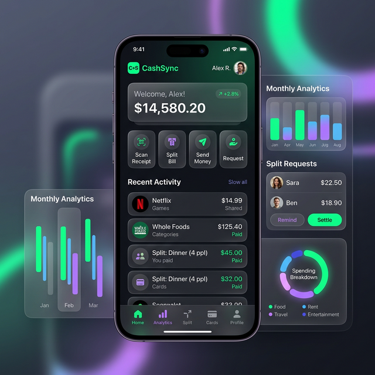
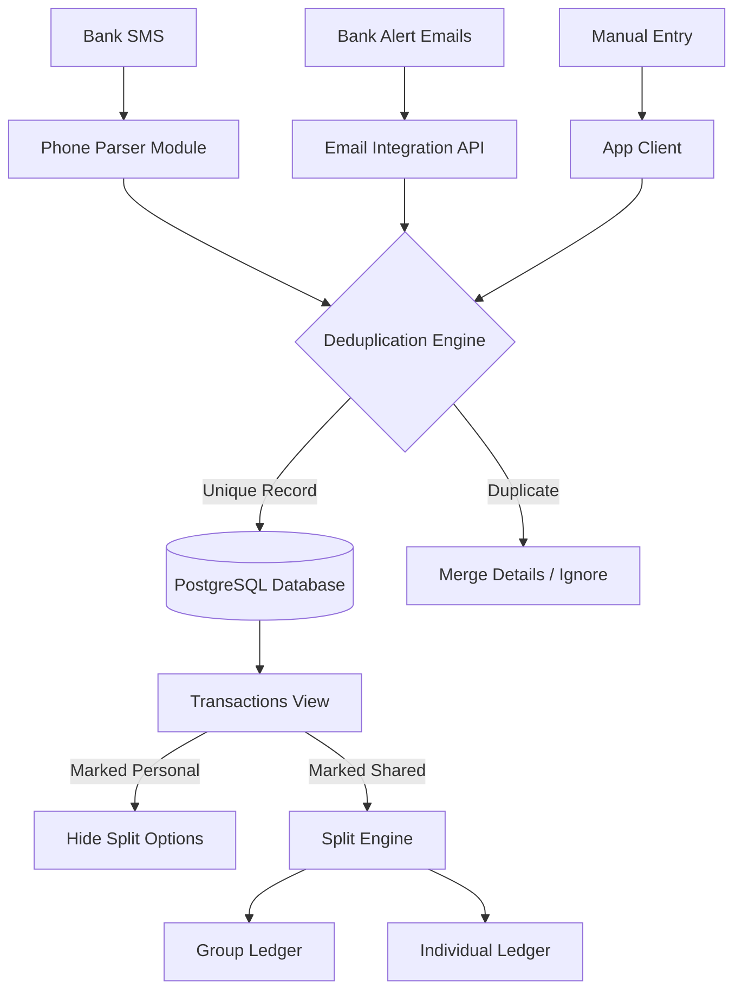

# CashSync: Product Design & Feature Roadmap



## 1. Vision & Core Concept

**CashSync** is a unified personal finance and expense-splitting application. It is designed to bridge the gap between keeping track of individual spending, household bills, and group trip expenses. It takes the transaction aggregation of tools like _Walnut_ or _Mint_, combines it with the powerful ledgering of _Splitwise_, and wraps it in a modern, ultra-premium UI.

> [!NOTE]
> CashSync aims to automate as much as possible through SMS parsing and email receipts before rolling out heavier Bank API integrations.

---

## 2. Platforms & Tech Stack

### Cross-Platform Architecture

To support **Android, iOS, Windows, macOS, and Linux**, a unified codebase strategy is required:

- **Core Mobile (Android/iOS)**: React Native (via Expo).
- **Core Web & Desktop (Windows/macOS/Linux)**: React Native Web / Next.js OR React with Electron/Tauri for native desktop behavior.
- **Backend Infrastructure**:
  - **Server**: Node.js with NestJS or Express
  - **Database**: PostgreSQL (Structured relationships like users, groups, transactions, splits)
  - **Cache & Queues**: Redis (for parsing queues and fast lookups)
  - **Deployment**: Vercel / AWS.

---

## 3. Core Features Breakdown

### 1. Unified Authentication (OAuth Identity Linking)

Users can log in via multiple providers seamlessly.

- **Providers**: Google, Apple
- **Identity Linking**: If a user logs in via Google today and Apple tomorrow with the same underlying email address, the accounts automatically merge into a single `User ID`.
- **No Passwords**: Reduces friction and enhances security.

### 2. Multi-Source Transaction Engine

Aggregates expenses from all connected sources automatically.

- **SMS Parsing Module**: An background service (mainly for Android) that reads localized bank SMS templates to extract:
  - Amount Debited/Credited
  - Merchant/Tag
  - Date and Time
- **Email Parsing Module**: Uses Gmail/Outlook APIs safely to read transaction alerts and digital receipts.
- **Bank API (Phase 2)**: Placeholder architecture for direct integration via Plaid / Salt Edge.

> [!TIP]
> **Smart Deduplication Engine**: To avoid duplicate entries across SMS, Email, and Bank API, CashSync will match `Amount` + `Transaction ID`. If ID is not present, it will use a composite fingerprint hash (`amount` + `fuzzy_date_within_2m` + `fuzzy_merchant`).

### 3. Smart Expense Splitting (The "Splitwise Killer")

A flexible debt tracker embedded directly inside the transaction feed.

- **Privacy Toggle (Personal Use)**: Each transaction has a "Personal Use" toggle. If marked as personal, splitting options are completely hidden from the UI.
- **Individual & Group Splitting**:
  - Easily assign transaction fractions to specific individuals.
  - Add transaction to previously created groups (e.g., "Goa Trip", "Apartment 4B").
- **Split Methods**: Equals, By Exact Amounts, By Percentages, or By Shares.
- **Settling Up**: Tracks who owes whom with simplified debt routes (minimizing the number of transactions needed to settle up within a group).

### 4. Categorization & Renaming

Make messy bank statements human-readable.

- **Auto-Tagging**: Initial mapping via Regex/ML (e.g., "SWIGGY\*BANGALORE" -> "Food").
- **Custom Labels & Renaming**: Users can rename transactions for easier tracking, and the system remembers these mappings for future entries.

---

## 4. Design & Aesthetics

The product must look and feel **modern, affluent, and heavily polished**.

- **Theme**: True Dark Mode with vivid accent glows (e.g., Neon Green for credits/positive actions, Soft Purple for analytics).
- **Material**: Heavy use of "Glassmorphism" inside cards, subtle border radiuses, and dynamic micro-interactions (hover states, spring animations).
- **Typography**: Uncluttered, geometric sans-serif (e.g., _Inter_, _Outfit_, or _SF Pro Display_).
- **Navigation**: Clean bottom tab bar on mobile, sleek sidebar on desktop.

---

## 5. System Data Flow



## 6. Project Rollout Phases

1. **Phase 1: Foundation & UI**
   - Build out the React Native/Web application shells.
   - Implement dark mode styling, UI components, and mock interactions.
   - Setup OAuth identity linking (Google/Apple).
2. **Phase 2: Data Ingestion Engine**
   - Develop SMS Receiver (Android).
   - Develop Manual entry flows.
   - Implement the Smart Deduplication logic.
3. **Phase 3: The Split Engine**
   - Database schema for Groups, Debts, and Settlements.
   - UI for selecting friends, splitting bills, and privacy toggling.
4. **Phase 4: Multi-platform Polish**
   - Wrap React Web logic via Electron for Windows/Linux/macOS native installers.
   - Finalize Email integration and push notifications.

---

## 7. Implemented MVP (Current Codebase)

### Backend

- User identity sync with provider-aware account linking (`/api/users/sync`)
- Transaction ingestion + analytics (`/api/transactions`)
- SMS parser + deduplication with fallback fingerprint hash (amount + 2-minute bucket + merchant signature)
- Split support with methods: `EQUAL`, `EXACT`, `PERCENT`, `SHARES`
- Group APIs:
  - `GET /api/groups?userId=...`
  - `POST /api/groups`
  - `POST /api/groups/:id/members`
  - `GET /api/groups/:id/ledger`
  - `POST /api/groups/:id/settle`
- Debt simplification in group ledger (minimized settle-up routes)

### Frontend (Expo, mobile + web)

- Auth screen with email/password and simulated OAuth flows
- Home dashboard with analytics, quick actions, and premium dark UI
- Transactions screen:
  - filtering by type/category
  - SMS ingestion modal
  - rename/re-categorize transactions
  - personal/shared toggle
  - split assignment flow
- New Groups screen:
  - create groups
  - add members by email
  - view suggested settle-up routes
  - settle from debtor side

### Verified Build

- Backend TypeScript build passes (`npm run build` in `backend`)
- Frontend type-check passes (`npx tsc --noEmit` in `frontend`)
- ESLint checks are available across backend + frontend (`npm run lint:check`)

---

## 8. Local Setup (One Command)

```bash
npm run bootstrap
```

Then start both apps:

```bash
npm run dev
```

### OAuth Configuration

Set these environment variables for real OAuth verification:

Backend (`backend/.env`):

- `GOOGLE_CLIENT_IDS=your-google-client-id.apps.googleusercontent.com`
- `APPLE_CLIENT_IDS=your-apple-service-id`
- `CORS_ALLOWED_ORIGINS=http://localhost:8081,http://localhost:3000`

Frontend (`frontend/.env`):

- `EXPO_PUBLIC_GOOGLE_CLIENT_ID=your-google-client-id.apps.googleusercontent.com`
- `EXPO_PUBLIC_APPLE_CLIENT_ID=your-apple-service-id`

For full architecture and endpoint reference, see:

- `docs/ARCHITECTURE.md`
- `docs/CODE_QUALITY.md` (ESLint + Sonar setup, CI integration, troubleshooting)
